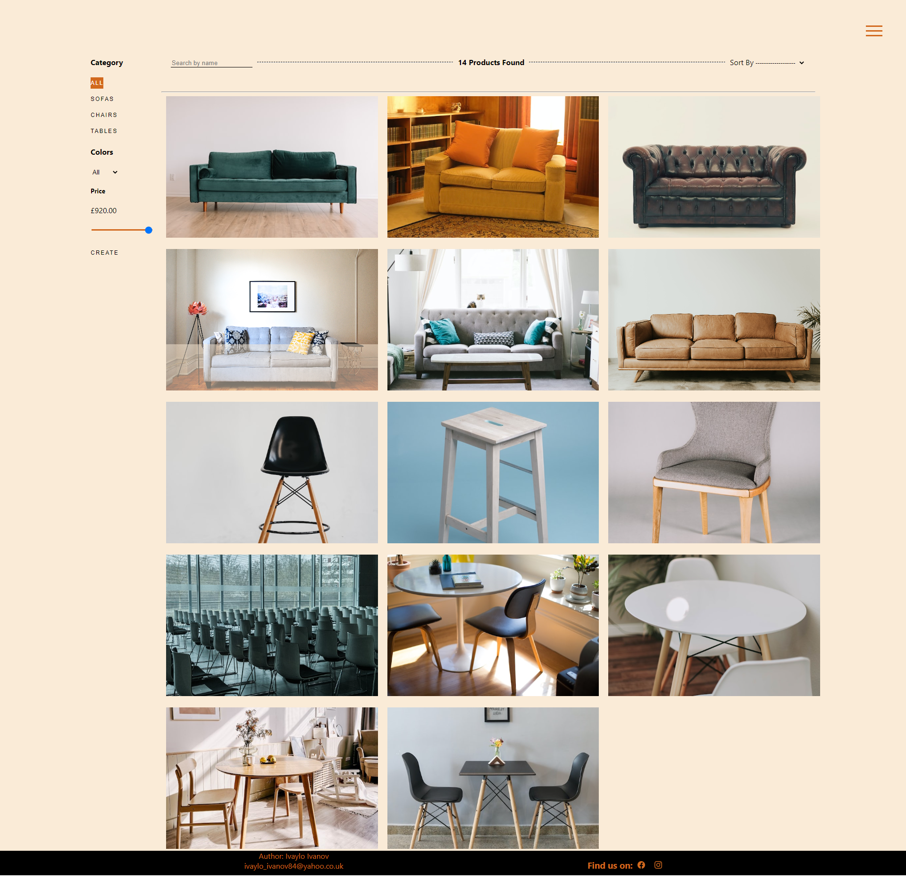

# Furncreate app

### Welcome to Furncreate! Our website is the perfect place to find beautiful and functional furniture for your home. We offer a wide range of styles, from traditional to modern, and our products are made with high-quality materials built to last.
 
<a href="https://furncreate-app.web.app/">Enter the site</a>
   

## There is temporary admin 
* email: georgi@yahoo.com
* password: 0987654321  

## Features
***

### Home Page - There are two buttons for the gallery and catalogue pages and short welcome text.

* #### Navigation - Navigation is the hamburger menu, which contains all links to pages except the dashboard and shopping cart.

* * #### Hamburger menu 

* * #### Links for Dashboard, Shopping cart and hamburger menu

* ### Catalog - The catalogue page consists of a list of products, there on the left side are filters by type, color and price. On the top side, there is a sort and filter by product name.

* ### Dashboard for admin

* * Products - You can check edit and delete products

* * Users - you can check and edit role for users

* * Purchase - you can see all purchase

